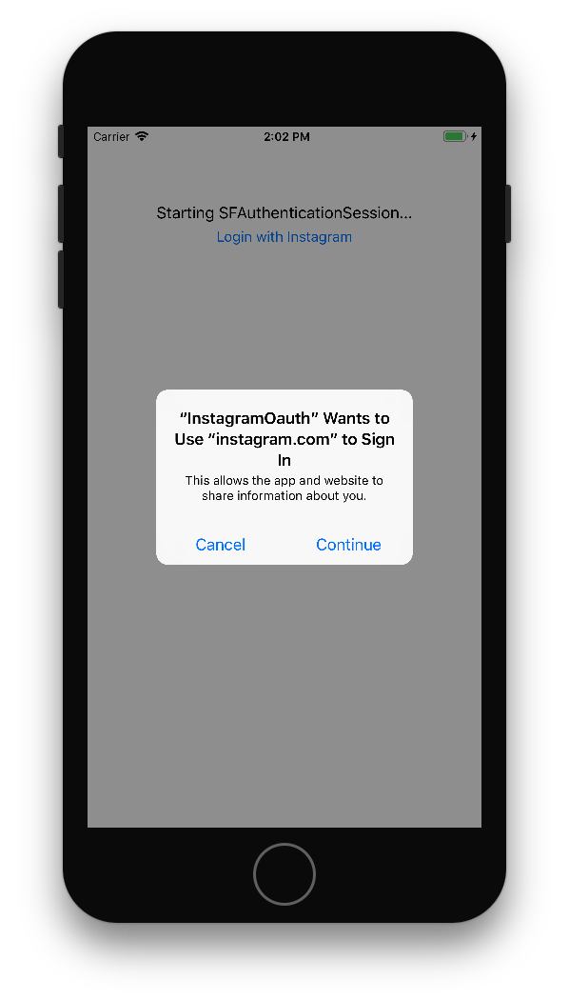
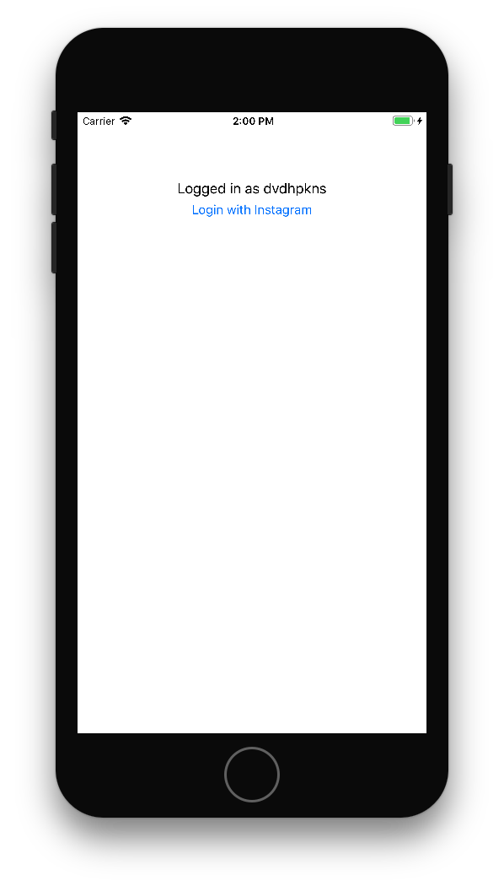

# Use SFAuthenticationSession to perform Oauth Login to Instagram

Example using iOS 11's [SFAuthenticationSession](https://developer.apple.com/documentation/safariservices/sfauthenticationsession) to login to Instagram. Contains a simple python Flask web service to handle Oauth callback and an iOS app that uses SFAuthenticationSession API to initiate auth flow. Session from Safari is shared, so users logged into web will already be logged in. Assumes you have some level of familiarity with Xcode and the command line, but does not require experience with python / Flask.

## Running

You will need to start the Flask server, and run the iOS app in the simulator using xcode 9 (beta). 

### Run the Server

The following assume you have python 2.7 installed and set as your default python version:

```bash
cd server
pip install virtualenv
source env/bin/activate
pip install -r requirements.txt
python app.py
```

### Run the App

Xcode 9 and iOS 11 are required to run the app. To attempt fetching cookies from Safari, do the following: 

1. Run the app in a device simulator
2. Click "Login with Instagram"
3. You will see a dialogue like the following: 
4. Click continue; a SafariViewController will be launched propting you to login using your Instagram username and password
5. You will be redirected into the main app veiw, with your username having been fetched from Instagram 
